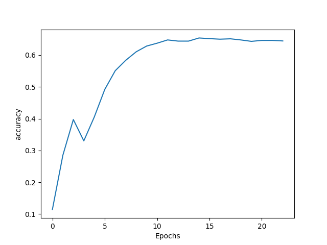

# DeepMumble

DeepMumble is a package to generate lyrics based on any artists style using machine learning. The package is interactive, allowing the user to extract the complete discography of an artist, train a machine learning model, and generate new lyrics. 

## Background

 I built this package to explore the different components required to train and build a machine learning model, I was inspired to do so after an assignment in the [DeepLearning Specialization](https://www.coursera.org/specializations/deep-learning). 

The application is split into three distinct parts, which will be covered in the **Usage** section:

1. Fetching lyrics and data cleanup
2. Training the ML model 
3. Generating new lyrics 


## Dependencies

### LyricsGenius
[LyricsGenius](https://github.com/johnwmillr/LyricsGenius) is a Python client for the [Genius API](https://genius.com/developers). This library is used to extract the lyrics and can be installed using pip by running the following command: 

    $ pip install lyricsgenius

In addition, you will require a Genius API **Client Access Token** to authorize access to the API and fetch the lyrics. You can get your token [here](https://genius.com/api-clients). After that, you will need to create a file named config.py in the main directory. Inside config.py, the **Client Access Token** will need to be set in the following format:

    api_key = <CLIENT ACCESS TOKEN>

### TensorFlow

The LSTM model is built using [TensorFlow](https://www.tensorflow.org/). Installation instructions for TensorFlow are available [here](https://www.tensorflow.org/install/pip).

In addition, NumPy and Matplotlib are also required and would need to be installed.

## Usage

### Fetching Lyrics

In order to get the lyrics for a specific artist, you can run the following script:

    $ python fetch_lyrics.py

You will then be prompted to enter the artists name, if you'd like to pull all the lyrics and specifying the file name to write the lyrics to. For this example, we will write all the lyrics for The Weeknd:

    Enter artist name to retrieve song lyrics: The Weeknd
    Do you want to pull all the artists lyrics (y/n): y
    Specify file name to write lyrics: TheWeekndLyrics

The script will then call the Genius API and start fetching the lyrics:

    Searching for songs by The Weeknd...

    Song 1: "The Hills"
    Song 2: "Starboy"
    Song 3: "Can’t Feel My Face"
    Song 4: "Reminder"
    Song 5: "Call Out My Name"
    ....

Once all the lyrics are fetched, they will be written under `Lyrics/TheWeekndLyrics.txt`. 

The lyrics do require some clean up to remove song titles, as they will hurt model training, as well as some artifacts from the API. In order to use the lyrics cleaner you can run the following script:


    $ python lyrics_cleaner.py


Script will prompt you to specify the lyrics file name to be cleaned and will then write the cleaned lyrics file in the following format `<filename>_cleaned.txt`:

    Specify file name: TheWeekndLyrics
    Lyrics were cleaned and written to TheWeekndLyrics_cleaned.txt

### Train Model 

To start training the model run the following:

```
$ python train_model.py
```
Then specify the lyrics file name to train on:

    Enter the lyrics file name: TheWeekndLyrics_cleaned

The script will then load the lyrics, and construct the LSTM model. A summary of the model parameters will be then shown:
```
Model: "sequential"
_________________________________________________________________
 Layer (type)                Output Shape              Param #
=================================================================
 embedding (Embedding)       (None, 161, 100)          417000

 bidirectional (Bidirectiona  (None, 300)              301200
 l)

 dense (Dense)               (None, 4170)              1255170

=================================================================
Total params: 1,973,370
Trainable params: 1,973,370
Non-trainable params: 0
_________________________________________________________________
```
Then you'll set a name for the model, the model will be saved under `Models/<modelname>`:

    Specify a name for the model: DeepAbel     

Training will then start, running for a maximum of 100 epochs. Training will stop before the maximum number of epochs is reached if the accuracy does not increase for 5 epochs as specified in the callback in `train_model.py`:

    # Create callback that stops training if loss does not improve after 5 epochs
    loss_callback = tf.keras.callbacks.EarlyStopping(monitor='loss', patience=5)

Once training is completed, the model will be saved under `Models/<modelname>` and the model accuracy will be plotted:



### Generate Lyrics 

In order to generate, load the model that was just trained by running the following:

```
$ python load_model.py
```

The lyrics file the model was built on will need to be reloaded as well, in order to create the word index dictionary:

    Enter the name of the lyrics file: TheWeekndLyrics_cleaned

Then enter the name of the model to load:

    Enter the name of the model to load: DeepAbel

Once the model is loaded, set a seed phrase to start generating lyrics: 

```
Enter a seed phrase to start lyrics generation from: I saw the fire in your eyes
```

The model will then start generating lyrics, upto the limit set in the variable `next_word`, which is currently 500:

    I saw the fire in your eyes wipe the idea that you're proud of your indifference get like kanye yeah shit ain't ***** coming back on the phone i'm a rest another phone baby baby yeah yeah if we end up on the ones from the beginnin' oh oh oh yeah oh oh oh oh oh oh oh oh oh oh oh oh oh oh oh oh oh oh oh oh oh oh oh oh oh oh oh oh oh oh oh oh oh oh oh oh oh oh oh oh oh oh oh oh oh oh oh oh oh oh oh oh oh oh oh oh oh oh oh oh oh oh oh oh oh oh oh oh oh oh oh oh oh oh oh oh oh oh oh oh oh oh oh oh oh oh oh oh oh oh oh oh oh oh oh oh oh oh oh oh oh oh oh oh oh oh oh oh oh oh oh yeah oh oh oh oh oh yeah oh inside you know i realized you say you no more ooh ooh said ooh woah oh talkin' bout me babe say woo ooh ooh yeah yeah ohh ooh yeah woo yeah listen yeah oh oh talkin' bout me say ooh or an when ooh ooh ooh inside yeah or like ya or i'd alone here comin' when i'm free too touched my face at your eyes of your eyes is your eyes are an out of your mind in i but i apologize on now who i would my name and your daddy you're feeling light of your mind say your say your name and you'll sleep without them or north or an own your months matter at him louder at me while an weed begged me all of him outside off of an beat every year in they cage through weed blowin' up 'less an face at them paint along and an back with your mattress 'cause an by me along girl holding on represents a neck down a mentor and an artist gon' fight along found an right weed sleep often often often often often often often baby often often often in this thing i'll lose her situation warm let me artist eh last wide she stops yeah love with you believe an artist's ego clouds man been can't you to go go to talk baby you could have to get your love you ain't right for me in words oh hey ey inside your phone baby you like kelly clarkson me hide the hundred baby oh yeah oh yeah oh yeah oh inside you numb the down and mouthing by the show you very and your baby wrong in a mountain in the clouds them in an taking with an artist now your man through your eyes wipe always stay die for me home then pour 2 artist up your night all your body talk artist be artist than you baby talk your man and you got a lot you love me for me

## Limitations and Future Improvements

- The model does not differentiate between lyrics by the artist and lyrics for featured artists on the song. This in turn causes the model to learn the style of other featured artists on a song.
- Transformers have been shown to preform significantly better than LSTMs, might be worthwhile to explore the usage of transformers.
- Lyrics cleaning script can be integrated with the fetch script.
- All lyrics are used for training with no validation test set. Split up training data into 3 sets, training, validation and test set.
- Create setup.py script to automate dependencies installation.
- Consolidate all the scripts into a main program.

## Contribution

Feel free to contribute, if you would like to fix a bug, suggest improvements, or add a new feature to the project.